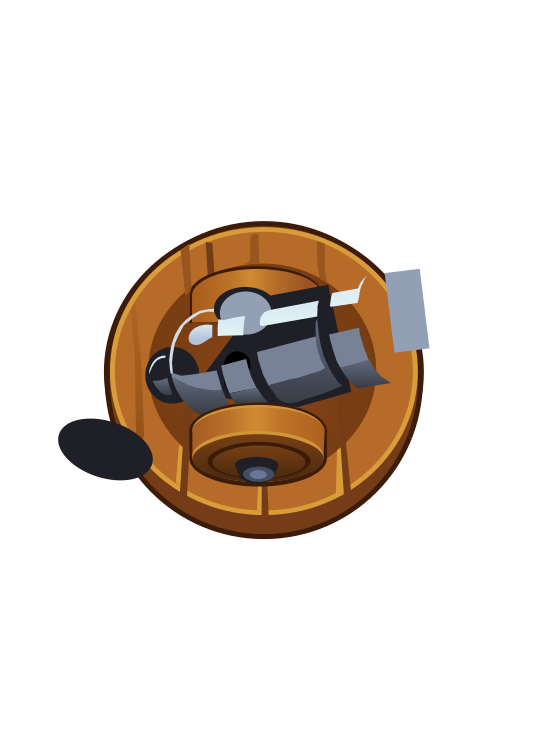

<p align="center">
  
</p>

<h1 align="center">TikTok Tower Defense</h1>

<p align="center">
  A 2D tower-defense game where <b>live TikTok gifts become in-game events</b>. Viewers cheer — towers fire, enemies spawn, chaos ensues.
</p>

<p align="center">
  
  
</p>

---

## About

The game listens to a TikTok live stream. Every gift, follow, or shoutout from the chat is turned
into an in-game action by the backend and pushed over WebSocket to the browser. The viewer chat
doesn't just watch — they play with you.

- **Gift → action** — backend gift handler normalizes TikTok events into game actions
- **WebSocket bridge** — real-time events streamed from backend to the running game
- **Pixi.js rendering** — silky 60 FPS sprites, animations, and effects in a 2D world
- **React dashboard** — build, sell, upgrade, and micromanage your defense while watching
- **OBS-ready modes** — the same app runs as a standalone game source or a control dashboard

## Modes

The frontend runs in one of three modes, chosen by URL (no mode = combined dev layout):

| Mode              | URL                                     | Notes                                                 |
| ----------------- | --------------------------------------- | ----------------------------------------------------- |
| `?mode=game`      | `http://localhost:8080/?mode=game`      | Standalone PixiJS game — use as an OBS Browser Source |
| `?mode=dashboard` | `http://localhost:8080/?mode=dashboard` | Control panel only, no PixiJS instance                |
| (default) `dev`   | `http://localhost:8080/`                | Old combined game + dashboard side by side            |

In `?mode=game` you can pass `&game_width=1920&game_height=1080` (or `width`/`height`) to fix the
canvas size; otherwise the game fills its container. The game mode registers with the backend as
role `game` (only one game client; a new one replaces the old). The dashboard mode registers as
role `dashboard` (any number allowed) and sends commands over WebSocket that the backend routes to
the game client.

## Live Flow Testing Dashboard

The dashboard (`?mode=dashboard`) includes a **Live Flow** panel that simulates TikTok LIVE events
locally and pushes them through the **same backend pipeline** as real TikTok events — no live stream
required.

- **Gifts** — pick a gift from the real catalog (fetched from the backend over WebSocket), set a
  quantity (`x1`/`x5`/`x10`/`x50`/`x100`), and send it as one or more viewers.
- **Likes / Follows / Comments / Shares / Viewers** — one-click and custom sends.
- **Stress Test** — fire a burst of events at a chosen rate for a chosen duration.
- **Live Event Log** — every event (real or simulated) is echoed to every dashboard.

Simulated events flow through the same `GiftProcessor` as real ones: tower gifts spawn/upgrade
turrets, enemy gifts spawn monsters, likes accumulate toward enemy spawns, and events sent while no
match is active are logged as `ignored: no active match`. The panel needs the backend running; the
dashboard sends `{ type: "simulate_tiktok_event", event }` packets, which the backend validates and
routes exactly like real `tiktok-live-connector` events.

## Tech Stack

| Layer    | Tech                                                  |
| -------- | ----------------------------------------------------- |
| Frontend | React 19, Pixi.js 8, TypeScript (strict), Vite        |
| Backend  | TypeScript, WebSocket (`ws`), `tiktok-live-connector` |

## Getting Started

### Backend

```bash
cd backend
npm install
cp .env.example .env
# edit .env — set TIKTOK_USERNAME (the account must be LIVE) and TIKTOOL_API_KEY
npm run dev
```

The backend connects to TikTok using the [`@tiktool/live`](https://www.npmjs.com/package/@tiktool/live)
client, which signs requests through the free [tik.tools](https://tik.tools) sign server
(no credit card, ~2,500 req/day on the free tier). Get a free API key at
[tik.tools](https://tik.tools) and put it in `TIKTOOL_API_KEY`. If the streamer is not
currently live, the backend logs the reason and **retries automatically with backoff** until
the stream goes live.

### Frontend

```bash
cd frontend
npm install
npm run dev
```

Set `VITE_WS_URL` (default `ws://<host>:3000`) if the WebSocket server runs elsewhere.

## Scripts

| Command         | Description               |
| --------------- | ------------------------- |
| `npm run dev`   | Run the dev server        |
| `npm run build` | Lint + type-check + build |
| `npm run lint`  | Run ESLint                |

## Repository Layout

```text
frontend/   Browser game — Pixi.js engine, React dashboard, assets
backend/    Gift-processing server — TikTok events → WebSocket
shared/     Shared types used by both sides
trash/      Unused/legacy assets
```

## Contact

- Email: [guschamp47@gmail.com](mailto:guschamp47@gmail.com)
- Telegram: [@tochd410](https://t.me/tochd410)
